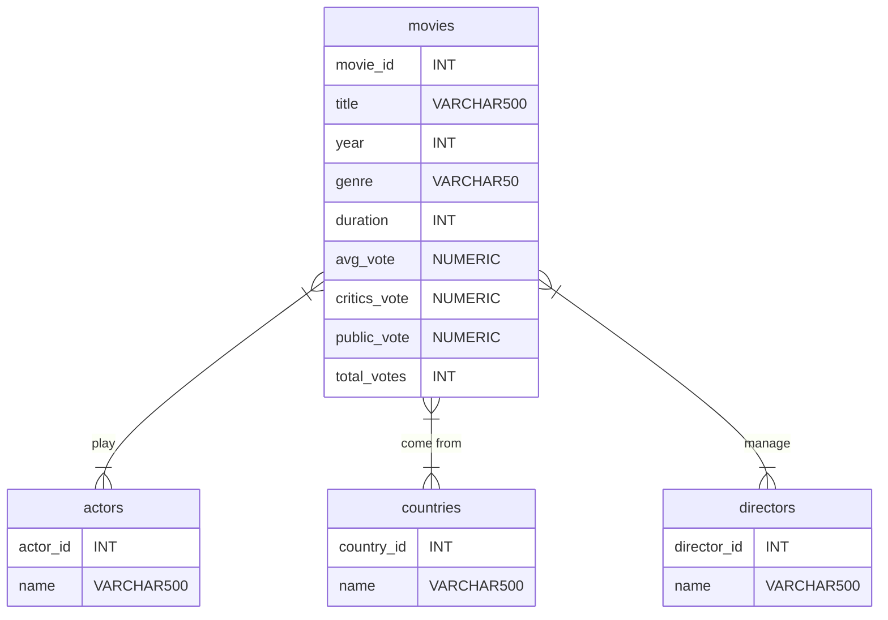

# Movie quizz :movie_camera:

## Description

This project implements a Python quizz about movies. The application is composed of three elements: a PostgreSQL database, an API and a Python quizz. The complete application can be launched with Docker.

The data used in the application come from https://www.kaggle.com/datasets/stefanoleone992/filmtv-movies-dataset and were originally scraped from the publicly available website https://www.filmtv.it.

## Architecture

### Database

The following schema represents the logical model of the database (entity-relation formalism).

Three associations are present in the database: *play*, *come from* and *manage*. Tables were created for each of them. For instance, the table play contains both the actor ID and the movie ID in order to join the table *actors* and the table *movies*. All instructions allowing to initialize the database (creation and filling of tables) are included into *database/init.sql* file. The Dockerfile in the *database* folder is used to create a Postgres container for the database. TCP port 5432 of the container is mapped to host port 5432.

### API
The API was deployed with Flask. Several endpoints were constructed in order to get information about movies and actors. It is also possible to add new movies, to modify existing ones or to delete some movies of the database. The file *apps/webservice/app.py* implements the API. The functions allowing to Create, Read, Update and Delete data were coded in the *apps/webservice/crud.py*. The Dockerfile in the *webservice* folder is used to create a Python docker container for the API. TCP port 80 of the container is mapped to host port 80. Thus, the API is available on the localhost on port 80.

### Quizz
All modules and classes used to implement the quizz are located in the *quizz* folder. The *quizz/object* folder contains the core of the application. The "factory" design pattern was used to create questions for the quizz. Different subject are proposed to the user in the quizz:
- countries associated with movies
- movies in which an actor has played in
- directors of a movie
- genre of a movie
- year of release of a movie

The *quizz/object/question_factory.py* file instanciate a question depending on its type.

The *quizz/main.py* file allows to launch the quizz. The user must select the number of questions he or she wants Questions are then randomly suggested to the user (the type of the question is randomly chosen).
The Dockerfile in the *quizz* folder is used to create a Python docker container for the quizz application.

## Installation

```bash
git clone https://github.com/alannagenin/movie-quizz.git
cd movie-quizz
python3 -m venv venv
source venv/bin/activate
```
### Environment setup
The following instructions add a .env file in the *apps/quizz* and *apps/webservice* folders. Please replace *\<username\>* with a chosen username and *\<password\>* with a chosen password.

```bash
env_content="POSTGRES_USER=<username>
POSTGRES_PASSWORD=<password>"
cd apps/quizz
echo "$env_content" > .env
cd ..
cd webservice
echo "$env_content" > .env
cd ..
cd ..
```

### Application launch

The following instruction build the project and runs it in daemon mode.

```bash
docker-compose up --d --build
```

### Quizz launch

Excecute the app-quizz container and open a bash terminal:
```bash
docker-compose exec app-quizz bash
```

Execute the following command into the bash terminal:

```bash
python main.py
```

### Deinstallation

```bash
# stop containers
docker stop webservice
docker stop quizz
docker stop database
# remove them definitely
docker-compose rm
```

## Examples of requests to the API

###  GET (accessible from any navigator)

- Information about an actor using his / her ID: **http://localhost/api/v1/actor/id/1**
- Information about an actor using his / her name: **http://localhost/api/v1/actor/name/abe vigoda**
- Information about movie using its ID: **http://localhost/api/v1/movie/id/39520**
- Information about movie using its ID: **http://localhost/api/v1/movie/title/the godfather trilogy: 1901-1980**

### POST (with Insomnia or Postman)

Add a new movie (it duplicates the movies if we execute the request several times):

**URL: http://localhost/api/v1/movie**

**BODY (json):**
```json
{
	"movie": {
		"title": "Funny Koalas",
		"year": 2023,
		"genre": "Comedy",
		"duration": 90
	},
	"countries": ["Australia"],
	"actors": ["Alice", "Bob"],
	"directors": ["Charlie"]
    }
```

### PUT (with Insomnia or Postman)

Add or update a movie (do not duplicate the movies):

**URL: http://localhost/api/v1/movie**

**BODY (json):**
```json
{
	"movie": {
		"title": "Funny Koalas",
		"year": 2022,
		"genre": "Documentary",
		"duration": 100
	},
	"countries": ["Australia"],
	"actors": ["Smart Koalas"],
	"directors": ["Alice"]
    }
```

### DELETE (with Insomnia or Postman)

Delete a movie using its name:

**URL: http://localhost/api/v1/movie/funny koalas**

## Contributors

* Alanna DEVLIN-GENIN
* Camille LE POTIER